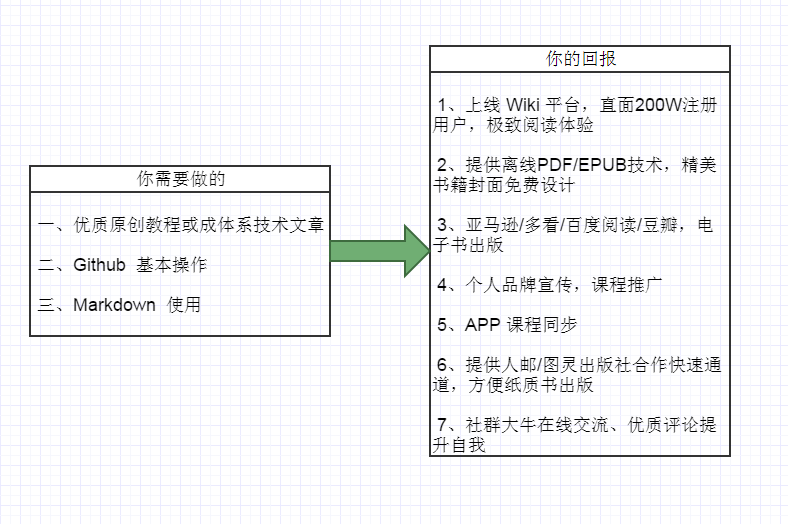

# 极客学院 Wiki 作者帮助中心

本手册包涵了 Wiki 创作的整个过程，新手只需一步步按手册操作就能完成。

同时，我们已经完美兼容 GitBook，只需花费几分钟时间通过简单地配置，就能搞定。如果你是 GitBook 用户，那么直接从 [配置 Webhook](webhook-config.md) 章节开始。

## 投入与产出

## 目录

- [关于我们](about.md)
- [Fork 示例仓库](setup-repo.md)
- [修改仓库名](operate-toc.md)
- [撰写内容](start-writing.md)
- [配置 Webhook](webhook-config.md)
- [自定义参数](config-json.md)
- [通知我们](inform-us.md)
- [发布上线](put-online.md)
- [联系我们](contact-us.md)

