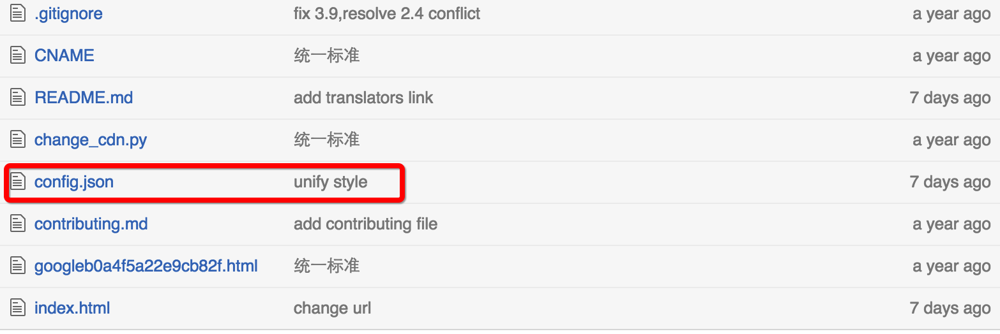

# 配置 config.json

## 为什么要配置？

config.json 使用 json 格式配置项目相关信息，包括项目名称、简介、重要文件及目录路径。

## 如何配置？

### 在项目主目录下新建 config.json 文件



### json 文件示例如下：

```
{
	"name": "The Swift Programming Language 中文版",
	"introduction": "中文版《The Swift Programming Language》",
	"path": {
		"content": "source",
		"toc": "source/SUMMARY.md",
		"readme": "source/README.md"
	}	
}
```

内容解释：

- name: 项目名称
- introduction: 项目简介
- path: 重要文件/目录路径
- content: 项目的主要文件存储相对路径
- toc: 项目的目录文件相对路径
- readme: 项目的 README 文档相对路径

