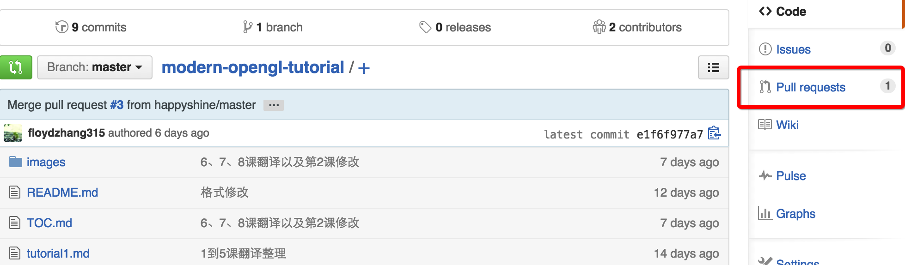
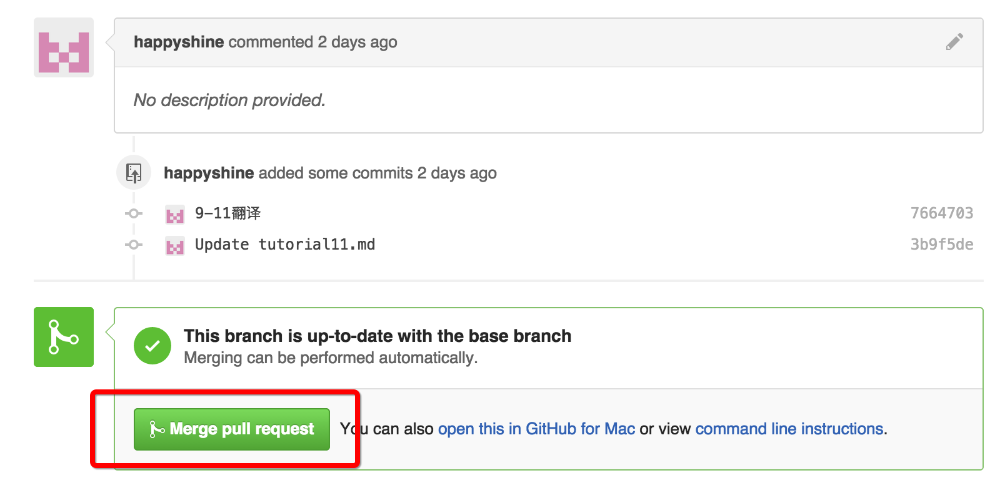

# 通知我们

Webhook 和 config.json 配置好后，需要通知我们进入下一环节

## 发送通知邮件

- 发送通知邮件至 wiki@jikexueyuan.com, 通知我们项目内容整理完毕
- 邮件内需写明以下内容：
   - 项目名称及拥有者 ID
   - QQ 号（用于上线后通知)
   - Github 项目的完整地址，如：[https://github.com/numbbbbb/the-swift-programming-language-in-chinese](https://github.com/numbbbbb/the-swift-programming-language-in-chinese)
  
  
## 接受 Pull Request

我们收到邮件后，会将项目相关的封面图及 logo 等内容放在 cover 文件夹下并推送至项目，请接受并 merge pull request:

至此，内容已经制作完毕，等待发布上线吧[发布上线](put-online.md)