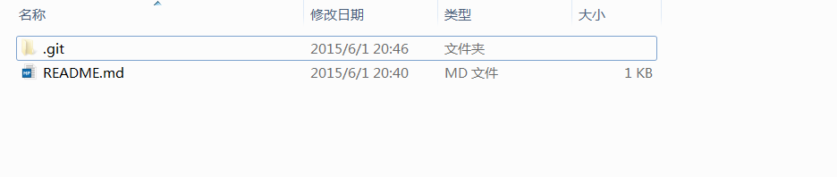

# 第一步 注册 GitHub，创建仓库

## 注册 GitHub 账号

<http://wiki.jikexueyuan.com/project/github-basics/sign-up.html>

## 创建仓库

<http://wiki.jikexueyuan.com/project/github-basics/creat-new-repo.html>

## 工具安装，克隆仓库到本地

Windows 用户详见文档：

<http://wiki.jikexueyuan.com/project/github-basics/github-for-windows.html>

Mac 用户详见文档：

<http://wiki.jikexueyuan.com/project/github-basics/github-for-mac.html>

>注意：你克隆到本地的文件内至少应包含一个 README.md 文件。

至此，你已经拥有了一个 GitHub 账号，一个新的仓库，一个本地的仓库。下一步，我们将要介绍创建基本的**文件目录格式**。

