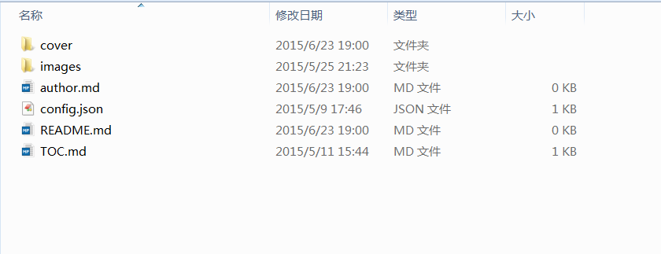
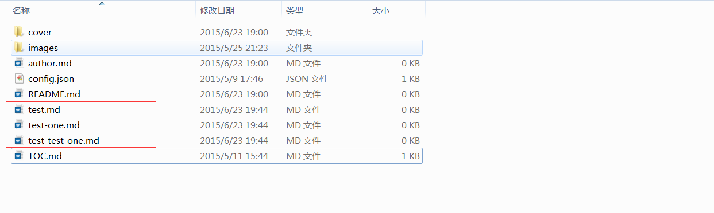

# 创建目录

## 创建文件目录

通过上一节的介绍，你已经有了一个远程仓库，一个本地的仓库，仓库里有一个 **README.md** 的文件。下面让我们开始创建基本的文件结构，在本地仓库文件位置 `C:\Users\Administrator\Documents\GitHub\test`下添加如下图所示文件和文件夹。



>注意：你的 GitHub 仓库的本地文件地址以克隆下来的地址为准。  
>提示：在本地仓库鼠标右键就可以创建，不同文件只需要改后缀名就能成功！

### 文件目录详解

- **cover/** - 存放 [官网首页](http://wiki.jikexueyuan.com/) 背景图片（图片由极客学院提供，后期整理上线时，编辑会添加）
 - background.png 或 background.jpg
 - logo.png 或 logo.jpg
 
- **images/** - 存放图片（用到的图片文件都放在这）

- **author.md** - 作者简介（选填）

- **README.md** - 说明文档（**必须有**，默认 wiki 首页显示，相当于书籍的序）

- **TOC.md** - 目录（**必须有**，该 wiki 的目录）

- **config.json** - 书籍名称和介绍（**必须有**）
  - "name": "书籍名称",
  - "introduction": "书籍内容简介。",
  
例如：config.json 文件配置展示如下

```
{
    "name": "Hibernate 高级教程",
    "introduction": "文章内容是对 Hibernate 高级特性的总结和学习。"
}
```
  
### 添加新文件

添加新文件，如下图：



>**重要**      
上面的文件路径都是可以自定义配置的，具体配置方法见：[自定义参数](config.md)
  
**在新建文件时，按照以下文件命名规范：**

- Markdown 文件：英文小写（多个英文减号连接）；  
正确：copywriting-guide.md  
错误：copywriting_guide.md、copywritingGuide.md、CopywritingGuide.md、copywriting guide.md

## 创建文章目录

`TOC.md` 文件是整本书的目录，它是各个章节的一个链接集合，下面我们举两个例子来说明：

### 简单模式

```

- [Chapter 1](chapter1.md)
- [Chapter 2](chapter2.md)
- [Chapter 3](chapter3.md)

```

### 多级目录模式

```
- [Part I](part-one.md)
    - [Writing is nice](writing.md)
    - [GitBook is nice](gitbook.md)
- [Part II](part-two.md)
    - [We love feedback](feedback_please.md)
    - [Better tools for authors](better_tools.md)
```

>注意：编写完 TOC.md 文件后，还需要创建对应的 md 文件。

到此，你已经开始了创作整理的路程了，下面一节，我们将讲解[撰写内容](start-writing.md)。

