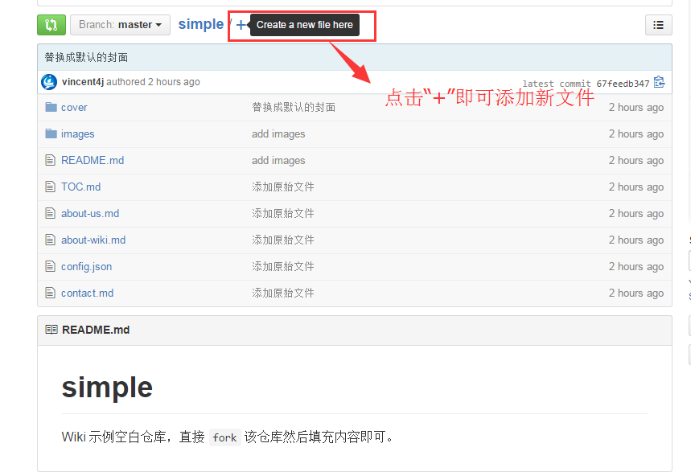
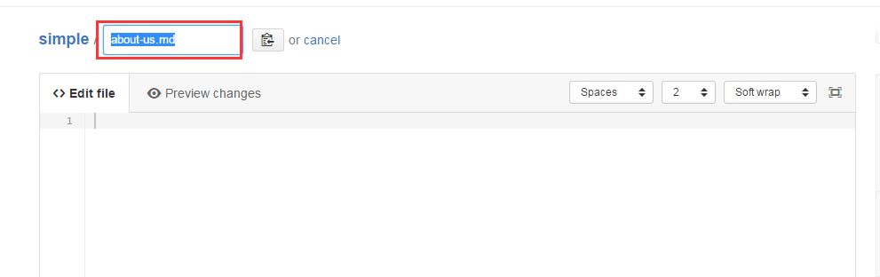
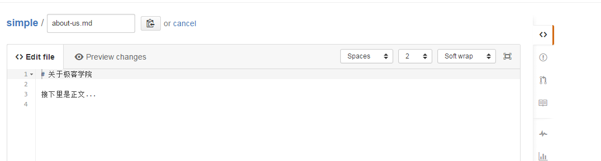
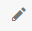
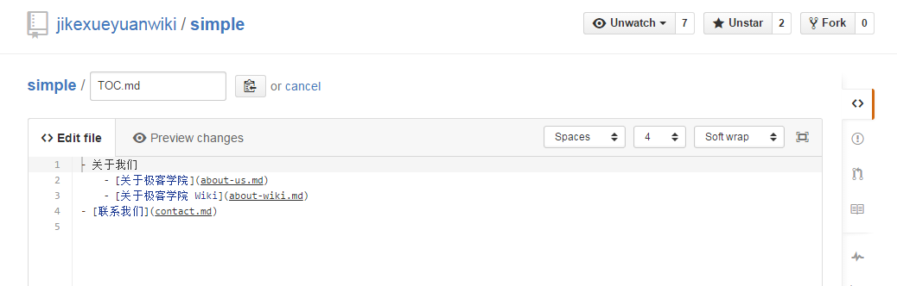

# 撰写内容

示例：<https://github.com/jikexueyuanwiki/simple/blob/master/TOC.md>

## 参考材料（10分钟掌握）

[Markdown 语法参考](markdown.md)

## 添加新文件

**文件名：about-us.md**

## 添加内容

**在对应的章节文件开始撰写内容**

例如:选择 **关于极客学院**

>提示：右上角的  是编辑按钮； 是删除按钮；是保存按钮。

## 添加目录

**目录 TOC.md**

当你撰写了一定章节的内容，想要查看在 Wiki 里面的展示效果时，那么你需要：[配置 Webhook](webhook-config.md)