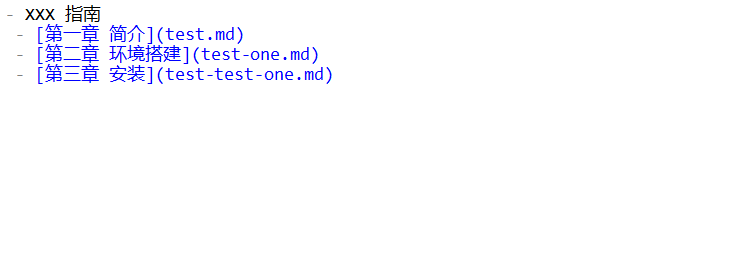
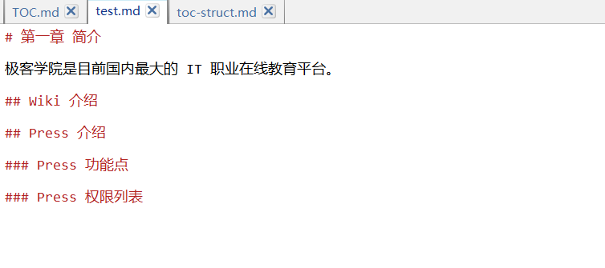

# 撰写内容

示例：<https://github.com/jikexueyuanwiki/guide/blob/master/TOC.md>

## 参考材料（10分钟掌握）

[Markdown 语法参考](markdown.md)

## 添加内容

1.**目录 TOC.md**

2.**在对应的章节文件开始撰写内容**

现在我们已经撰写了一定章节的内容，那么我们可以进行下一步了：[配置 Webhook](webhook-config.md)