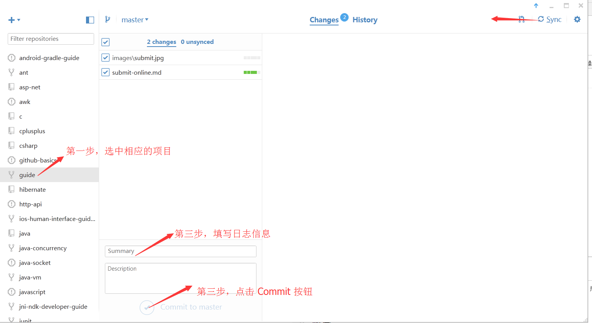

# 第五步 提交，上线

## 本地上传远程

当你创作整理完成后，可以去 GitHub 图形工具里面点击对应的项目，然后填写日志信息，就可以提交远程了。
具体操作看下图。

## 发送 SSH 地址

### 如何发送 SSH 地址

SSH 地址：

### 邮件

你也可以将你的仓库 SSH 地址发送到邮箱 wiki@jikexueyuan.com。请按 “名字+SSH（或Http）” 的格式发送。

例如：**张三 git@github.com:wenquan0hf/hibernate.git**

