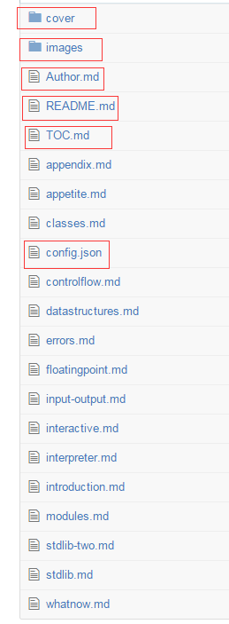

# 目录结构

标准目录模版

- cover/ - 存放 [官网首页](http://wiki.jikexueyuan.com/) 背景图片（图片由极客学院提供，后期整理上线时，编辑会添加）
 - background.png 或 background.jpg
 - logo.png 或 logo.jpg
 
- images/ - 存放图片（用到的图片文件都放在这）

- Author.md - 作者简介（选填）

- README.md - 说明文档（**必须有**，默认 wiki 首页显示）

- TOC.md - 目录（**必须有**，该 wiki 的目录）

- config.json - 文章名称和介绍（选填）
  - "name": "文章标题",
  - "introduction": "文章内容简介。",
  - "title": "一句话介绍文章 - 极客学院 Wiki",
  - "keywords": "涉及到的关键词",
  - "description": "通过本文能够得到什么。"

- name-is.md - 正文 1，比如：access-control.md（不加序号，单词全部小写，单词之间用减号分隔）

- name-that.md - 正文 2，比如：advanced-operators.md（不加序号，单词全部小写，单词之间用减号分隔） 

>**重要**      
所有的文章 `md` 文件都直接放于仓库的根目录下，不要在根目录下新建文件夹。
  
**在新建文件时，按照以下文件命名规范：**

- Markdown 文件：英文小写（多个英文减号连接）；  
正确：copywriting-guide.md  
错误：copywriting_guide.md、copywritingGuide.md、CopywritingGuide.md、copywriting guide.md

