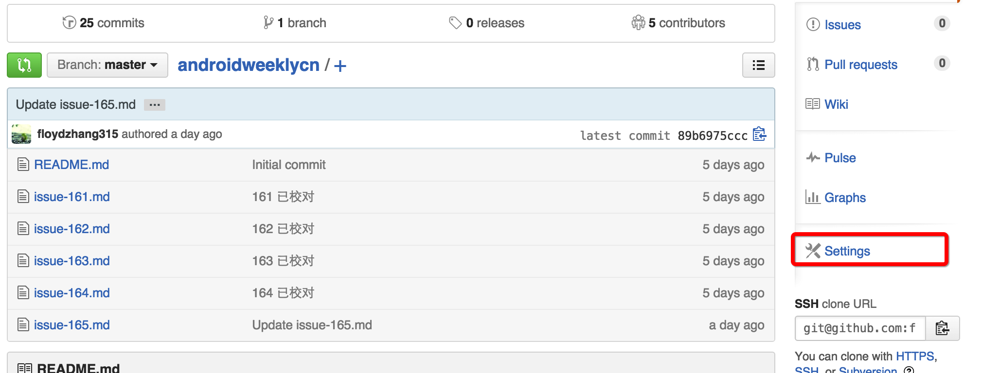
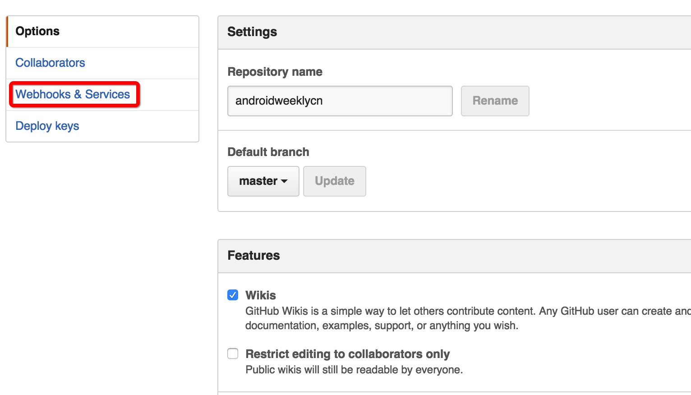
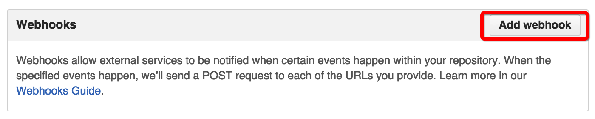
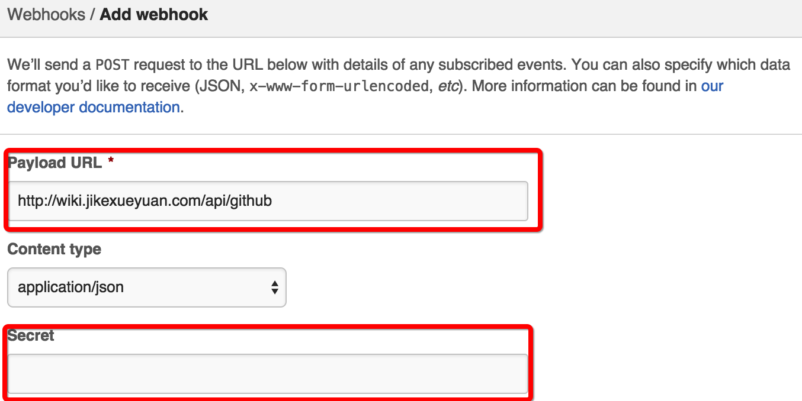
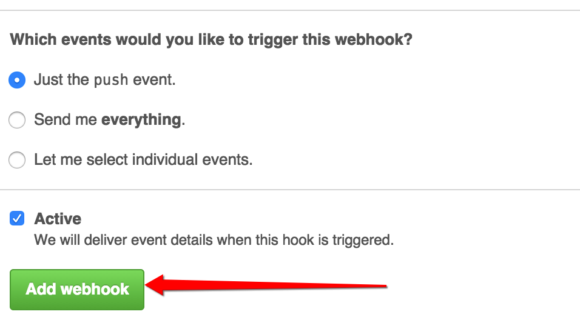
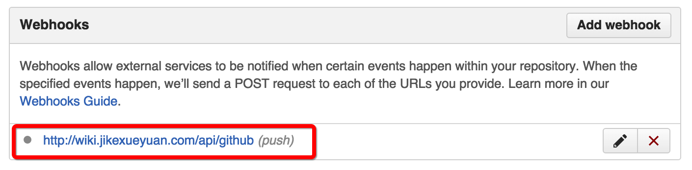

# 第四步，配置 Webhook

## 为什么要配置 Webhook

为了能使您在 Github 上的任何更新都能与我们的在线内容同步，需要配置 Webhook

## 配置 Webhook 的步骤

### 1. Github 项目首页点击右侧 Settings

### 2. 点击左侧 Webhooks & Services

### 3. 点击 Add webhook 按钮

### 4. 输入 Github 密码

### 5. 将我们的 Webhook 地址粘贴到 Payload URL，Secret 留空

**Webhook 地址: http://wiki.jikexueyuan.com/api/github**

### 6. 点击 Add Webhook 按钮，添加 Webhook

### 7. 添加完成   

配置完 WebHook后，就能够上线了，下面[第五步，通知我们](inform-us.md)
